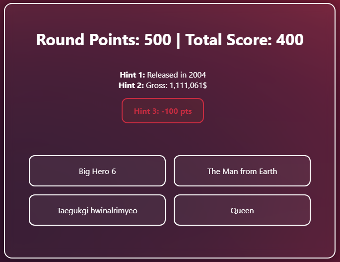

# IMDB Quiz


- Python + Flask
- PostgreSQL (with SQLAlchemy and regular SQL)
- HTML + CSS3
- Environment Variables via `.env`

- Data: https://www.kaggle.com/datasets/harshitshankhdhar/imdb-dataset-of-top-1000-movies-and-tv-shows
---

## ER-Diagram


---

## Setup Guide

### 1. Clone the Repo

```bash
git clone https://github.com/Alfemil99/IMDBQuiz.git
cd IMDBQuiz
```

### 2. Create Virtual Environment
#### Mac
```bash
python -m venv venv
source venv/bin/activate
pip install -r requirements.txt
```

#### Windows
```bash
python -m venv venv
venv\Scripts\activate (Might have to use "Set-ExecutionPolicy -Scope Process -ExecutionPolicy Bypass")
pip install -r requirements.txt
```

#### If error on 'venv\Scripts\activate' try:
```bash
Set-ExecutionPolicy -ExecutionPolicy RemoteSigned -Scope CurrentUser
```

### 3. Configure Environment Variables

Create a `.env` file based on `.env.example`:

```bash
cp .env.example .env
```

Update `.env` with your local PostgreSQL credentials.
If you're using other informations on your .env, be sure to use these for the psql steps to minimize reisk of error.

### 4. Set Up the Database Locally

log into SQL Shell and paste this code to activate a new database, with leaderboard table:

```sql
CREATE DATABASE myappdb;
CREATE USER myuser WITH PASSWORD 'mypassword';
GRANT ALL PRIVILEGES ON DATABASE myappdb TO myuser;

\c myappdb

CREATE TABLE leaderboard (
    id SERIAL PRIMARY KEY,
    username TEXT NOT NULL,
    score INTEGER NOT NULL,
    played_at TIMESTAMP DEFAULT CURRENT_TIMESTAMP
);

GRANT USAGE ON SCHEMA public TO myuser;
GRANT CREATE ON SCHEMA public TO myuser;

GRANT SELECT, INSERT, UPDATE, DELETE ON leaderboard TO myuser;
GRANT USAGE, SELECT ON SEQUENCE leaderboard_id_seq TO myuser;

```

---

## 5. Import the csv database

Run import_csv.py to insert IMDB.csv and leaderboard.csv data into PSQL

```bash
python import_csv.py
```
---

## 6. Run the code

Run the code

```bash
python run.py
```


Visit [http://127.0.0.1:5000](http://127.0.0.1:5000) to test.

---

## How to play:
* You start the game at the main menu where you can see the leaderboard.
* You then choose your player name for the next playthrough. When you have chosen your name and pressed start, the first hint appears.
* You start by getting one hint and four possible movies to guess. The hints start by being hard, but get progressively easier by pressing the hint button more. But be careful of getting too many hints. For each hint the amount of points you get by answering correctly is reduced. So if you want a high score you have to take some risks.
* If you answer correctly the game will show you that you guessed correctly, if not the you will see what the right movie was and be sent to the main menu again.
* If you guessed correctly a new movie has to be guessed.
* When you fail your score and name will be added to the leaderboard from highest to lowest.


